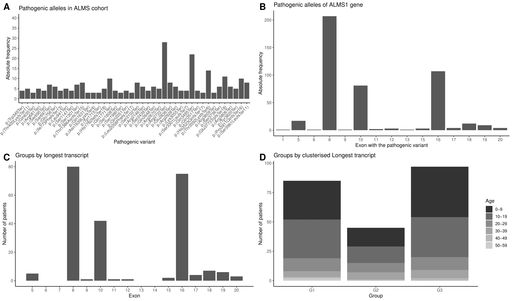
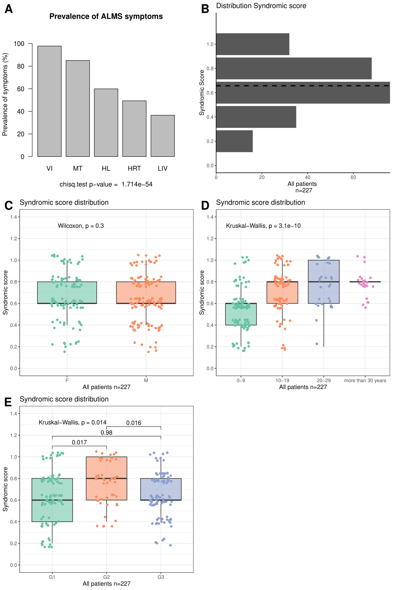
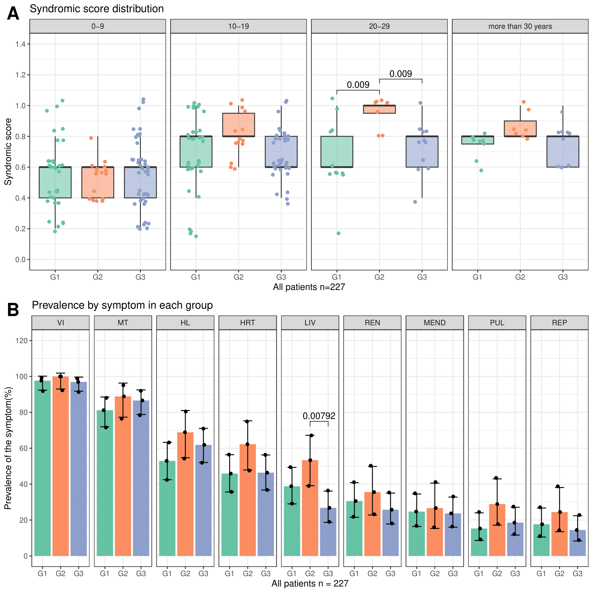
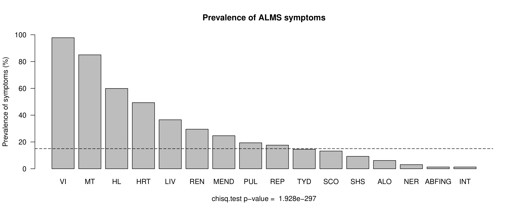
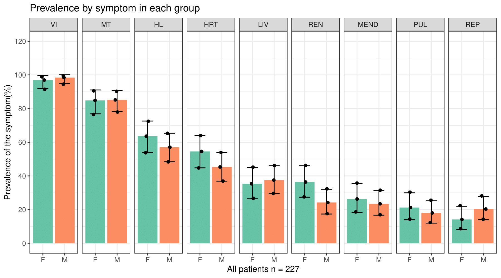
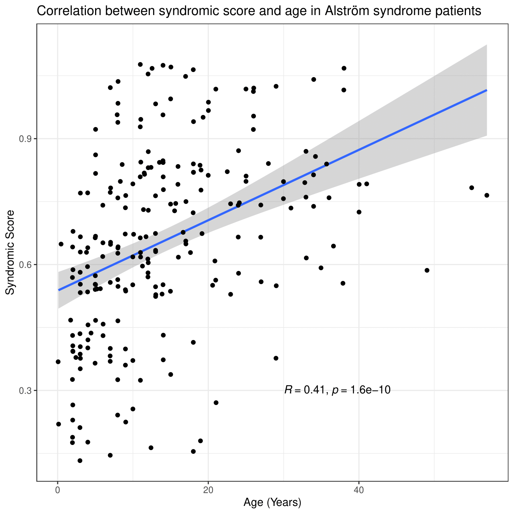

# Alström Syndrome Genotype-Phenotype Meta-Analysis

This repository contains the code and data for a genotype-phenotype meta-analysis focusing on Alström syndrome, a rare ciliopathy disorder.

Part of the code used was adapted from Niedarlova et al., 2019 in:

```
Niederlova V, Modrak M, Tsyklauri O, Huranova M, Stepanek O. Meta-analysis of 
genotype-phenotype associations in Bardet-Biedl syndrome uncovers differences among causative 
genes. Hum Mutat. 2019 Nov;40(11):2068-2087. doi: 10.1002/humu.23862. Epub 2019 Jul 29. PMID: 31283077.
```

## Overview

Alström syndrome is a rare genetic disorder belonging to the ciliopathy group. This meta-analysis aims to investigate the relationship between genotype and phenotype in Alström syndrome patients using data obtained from the literature.

## Figures

### Figure 1: Cohort Description
This figure provides an overview of the cohort obtained from the literature. It includes:
- Absolute frequency of different pathogenic alleles in the cohort.
- Frequency of these alleles grouped by exon.
- Count of each group after grouping by the longest allele of each carrier.
- Number of patients in each group.
- Age composition of these groups.




### Figure 2: Prevalent Symptoms Analysis
This figure analyzes the symptoms with the highest prevalence in the cohort. It calculates a syndromic score based on these symptoms and studies how this score is distributed across different sexes, ages, and genetic groups.




### Figure 3: Syndromic Score Evolution
This figure studies the evolution of the syndromic score in different genetic groups across different age intervals (every 10 years). It also examines the prevalence of the nine most prevalent symptoms in the cohort.



## Supplementary Analyses

### Prevalence of Symptoms
This analysis explores the prevalence of each of the 16 symptoms collected from the literature.



### Symptom Analysis by Sex
This figure examines the analysis of each symptom in the cohort by sex.



### Correlation Analysis between Syndromic Score and Age
This figure presents an analysis of the correlation between the syndromic score and the age of the patient.



## Usage

To replicate the analysis or explore the data further, follow these steps:

1. Clone this repository to your local machine.
2. Open the `.Rproj` file in RStudio.
3. Ensure you have `renv` installed and activated. If not, install it using `install.packages("renv")` and activate it using `renv::init()`.
4. Open the `analysis_pipeline.R` script located in the `src/main` directory.
5. Run the script to perform the analysis and generate the figures. Make sure all necessary packages are installed by running `renv::restore()` before running the script.
6. Explore the generated figures and data files for further insights.

## File Structure

- `R/analysis_pipeline.R`: Contains the R code for conducting the analysis and generating the figures.
- `R/utils.R`: Contains auxiliary functions for the analysis.
- `tests/`: Directory for test scripts.
- `data/`: Directory containing the datasets used in the analysis.
- `results/`: Directory containing the results of the analysis.
  - `figures/`: Directory for generated figures.
  - `tables/`: Directory for generated tables.

## Data

The data used in this analysis is sourced from the literature and is available in the `data` directory. Detailed documentation for each dataset is provided within the directory.

## Citation

If you use this code or data in your research, please cite as:

```
Bea-Mascato B, Valverde D. Genotype–phenotype associations in Alström 
syndrome: a systematic review and meta-analysis. Journal of Medical Genetics 2024;61:18-26.
```

## License

This project is licensed under the [MIT License](LICENSE).

---
**Note:** Please feel free to reach out with any questions, suggestions, or improvements! We welcome contributions from the community.

